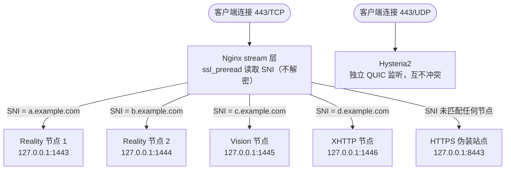

# JQ's Proxy Stack Manager

```
       _    ___          ____    ____    __  __
      | |  / _ \        |  _ \  / ___| |  \/  |
   _  | | | | | |       | |_) | \___ \ | |\/| |
  | |_| | | |_| |       |  __/   ___) | | |  | |
   \___/   \__\_|       |_|     |____/ |_|  |_|

  Proxy Stack Manager  ·····  ◆ jinqians.com
  ──────────────────────────────────────────
  IP    ▶  x.x.x.x              Nginx     ▶  1.x.x
  Xray  ▶  x.x.x                Hysteria2 ▶  2.x.x
  ──────────────────────────────────────────
```

---

## 简介

**Proxy Stack Manager（PSM）** 是一套基于 Bash 的 Linux 代理服务器一站式管理工具，通过 `psm` 命令一键安装 VLESS Reality / Vision / XHTTP、Shadowsocks、Hysteria2、Snell（v4 / v5 / v6）等多种代理协议，并统一管理 Nginx、SSL 证书、节点流量监控与 Telegram Bot 通知、VPS 安全防护、Docker 应用、Cloudflare 服务等。

每个节点都能自动生成密钥对，导出分享链接与二维码，支持 Clash Meta / shadowrocket 配置导出；证书通过 acme.sh 自动签发续期，无需手动操作。多个协议节点还可以共用同一个 443 端口对外呈现（详见下文）。

---

## 443 端口复用

多个协议节点可以共用同一个公网 443 端口对外呈现——不需要为每个协议 / 每个域名单独开一个端口。原理是 Nginx `stream` 层的 `ssl_preread`：在不解密流量的前提下读出 TLS ClientHello 里的 SNI（客户端要访问的域名），再按域名分发给对应的后端。



带来的好处：

- **对外只暴露一个端口**：防火墙只需放行 443，减少可被扫描到的攻击面
- **一台机器多个身份**：不同协议节点、以及给 GFW 探测看的伪装网站，可以同时挂在 443 上，靠域名区分，互不干扰
- **一个节点多个租户**：不需要为每个用户单独开一个端口/一套密钥，同一个 SNI 下的多个 UUID 共享入口，各自流量独立计费
- **UDP 443 独立复用**：Hysteria2 走的是 UDP，和上面的 TCP 分流是两个独立的监听栈，端口号相同也不会冲突

---

## 如何使用

### 一键安装

以 root 身份在 VPS 上执行，自动安装至 `/opt/psm` 并注册 `psm` 命令：

```bash
# 使用 curl（推荐）
bash <(curl -fsSL https://psm.jinqians.com)

# 使用 wget（系统未安装 curl 时）
bash <(wget -qO- https://psm.jinqians.com)
```

> 已安装的机器上重复执行同一命令，会自动 `git pull` 更新，不会重新跑一遍安装向导。

安装完成后，随时输入：

```bash
psm
```

进入交互式主菜单。

### 手动安装

```bash
git clone https://github.com/jinqians/proxy-stack.git /opt/psm
bash /opt/psm/install.sh
```

### 系统要求

| 发行版                  | 最低支持版本       |
| ----------------------- | ------------------ |
| Ubuntu                  | 20.04 LTS 及以上   |
| Debian                  | 10 (Buster) 及以上 |
| CentOS / RHEL           | 8 及以上           |
| Rocky Linux / AlmaLinux | 8 及以上           |
| Oracle Linux            | 8 及以上           |
| Amazon Linux            | 2 及以上           |
| Fedora                  | 较新的受支持版本   |

> 未在此列表内、或版本更低的系统（如 CentOS 7、Debian 9、Ubuntu 18.04 及更早）未做适配和测试，不保证可用。

| 项目     | 要求                                                                 |
| -------- | -------------------------------------------------------------------- |
| 运行权限 | root                                                                 |
| 系统架构 | x86_64 · arm64                                                      |
| 基础依赖 | `curl` 或 `wget`（预装其一即可）· `git`（bootstrap 自动安装） |

其余依赖（`jq`、`openssl`、`qrencode`、`unzip`、`iptables`、`fail2ban` 等）在各功能模块首次使用时按需自动安装。

### 主菜单

```
══════════════════════════════════════════════════════════════
                  JQ's Proxy Stack Manager
══════════════════════════════════════════════════════════════
   1. 系统管理                    9. Cloudflare DDNS
   2. Nginx 管理                 10. 网站管理
   3. Xray 管理                  11. 查看所有节点
   4. Hysteria2 管理             12. 备份管理
   5. Snell 管理                 13. 恢复备份
   6. SS 2022 管理               14. 更新 PSM
   7. Docker 管理                15. 流量管理
   8. SSL 证书管理               16. Telegram Bot
  17. 安全加固
──────────────────────────────────────────────────────────────
   0. 退出
══════════════════════════════════════════════════════════════
```

### 非交互模式（用于 cron / systemd timer）

```bash
manager.sh --ddns-update           # 执行一次 Cloudflare DDNS 更新
manager.sh --backup-full           # 执行一次全量备份
manager.sh --backup-quick [标签]   # 执行一次快速备份
manager.sh --update                # 更新 PSM 脚本和组件
manager.sh --traffic-check         # 执行一次流量统计检查
manager.sh --tgbot                 # 启动 Telegram Bot 守护进程
manager.sh --reality-watchdog      # 执行一次 Reality 伪装目标测活
manager.sh --honeypot-alert <ip> <port>  # 蜜罐命中告警（由 fail2ban 调用）
manager.sh --health-report         # 发送一次每日体检报告
```

这些都是各自功能模块背后的定时任务真正调用的入口，菜单里对应的"启用定时任务"选项会自动帮你注册好，不需要手动配置 cron。

### 卸载

```bash
bash /opt/psm/uninstall.sh
```

对每个组件逐一询问是否删除，备份文件默认保留。

---

## 项目功能特性

### 代理协议

- **Xray** — Reality / Vision / XHTTP / SS2022，多节点管理，自动生成密钥对，导出 VLESS URI（含二维码）/ Clash Meta / Sing-box
- **Reality 多目标自动测活切换** — 为伪装目标配置多个候选 SNI，定期做真实 TLS 1.3 握手检测，挂了自动切换，旧客户端链接依然有效
- **Cloudflare WARP 出站解锁** — 一键注册 WARP 身份并接入 Xray 出站，配合分流规则把 Netflix / OpenAI 等域名的流量导到 WARP
- **出站分流** — 自定义出站节点（VLESS-Reality / TLS / XHTTP、Shadowsocks、Trojan、SOCKS5），按域名 / GeoIP / GeoSite 规则转发到指定出站
- **Hysteria2** — UDP 代理，密码认证，带宽限制，masquerade 伪装
- **Snell** — v4 / v5 / v6，PSK 认证，Surge 格式导出
- **SS 2022** — shadowsocks-rust 独立部署，`ss://` URI 导出（含二维码）

### 基础服务

- **Nginx** — SNI 多协议分流，站点管理，HTTPS 伪装站点
- **SSL 证书** — acme.sh 自动签发（HTTP-01 / DNS-01 通配符），自动续期
- **Cloudflare** — DDNS 动态更新、DNS 记录管理、DNS-01 通配符证书
- **Cloudflare Tunnel** — 免开放任何端口，把本机服务（Docker 应用、管理面板等）暴露到指定域名
- **Cloudflare Access** — 在 Tunnel/Nginx 暴露的域名前加一层邮箱验证门禁，专门用于保护 Portainer、Nginx Proxy Manager 这类管理类应用
- **Docker** — 安装管理、一键应用商店（Portainer / Uptime Kuma / Netdata / AdGuard Home / Vaultwarden / Alist 等）、部署前端口冲突检测、暴露方式可选（仅本机 / 直接公网 / Nginx 反代 / Cloudflare Tunnel）、数据卷纳入备份

### 安全加固

- **SSH 安全加固** — 一键切换密钥登录、禁用密码认证、更改监听端口；所有高风险改动都通过 `reload`（不掐断当前会话）应用，并带 5 分钟自动回滚保护，不确认就自动撤销，避免把自己锁在门外
- **Fail2ban 防爆破** — SSH 登录失败自动封禁，内置"惯犯"规则对多次被封的 IP 施以更长封禁，支持 IP 白名单
- **蜜罐诱捕** — 在 RDP / MSSQL / Telnet 等本机不该有服务的端口设置陷阱，一旦被连接即视为踩点扫描，自动永久封禁并推送 Telegram 告警；端口占用检测会自动排除 SSH、已配置的代理协议、Docker 服务等，不会误伤正常服务

### 运维监控

- **流量管理** — 按节点设置月度流量配额，达阈值自动暂停，每分钟统计，月末自动重置
- **到期管理** — 按节点设置到期时间，临期 / 到期自动提醒并暂停服务，支持一键续费
- **每日体检报告** — 定时通过 Telegram 推送一份汇总报告：流量预警、到期提醒、Reality 测活切换记录、SSH/BBR/Fail2ban/蜜罐/WARP 状态，一条消息看全貌
- **Telegram Bot** — 查询节点流量、管理用户绑定、到期续费、体检报告，全部可在 Telegram 内完成，无需登录服务器
- **备份与恢复** — 全量 / 选择性备份（含 Docker 数据卷），定时备份，一键恢复
- **系统管理** — BBR 拥塞控制、sysctl 网络调优、防火墙、DNS、时区

---

## 目录结构

```
/opt/psm/
├── bootstrap.sh          # 一键安装入口
├── manager.sh            # 主入口（交互菜单 + 非交互调用）
├── install.sh            # 首次安装向导
├── update.sh             # 自更新和组件升级
├── uninstall.sh          # 引导式卸载
├── config/               # 运行时状态与配置（gitignore）
├── lib/
│   ├── common.sh         # 公共工具函数
│   ├── xray/             # Reality / Vision / XHTTP / SS2022 / WARP / 出站分流 / 测活
│   ├── security/         # SSH 加固 / Fail2ban / 蜜罐
│   ├── cloudflare/       # Tunnel / Access
│   ├── docker/           # 数据卷备份等 Docker 扩展
│   ├── tgbot/            # Telegram 通知模板 / 每日体检报告
│   ├── expiry/           # 到期管理
│   ├── hysteria2.sh / snell.sh / ssrust.sh
│   ├── nginx.sh / cert.sh / cloudflare.sh
│   ├── docker.sh / system.sh / backup.sh / traffic.sh
│   └── tg_bot.sh
├── templates/            # 配置模板（含 Docker 应用商店模板）
└── backup/               # 备份归档
```

---

## 捐赠

如果这个项目对你有帮助，欢迎请作者喝杯咖啡 ☕️——支持 USDT 打赏。

| 网络              | 扫码捐赠 | 地址                                           |
| ----------------- | -------- | ---------------------------------------------- |
| **TRC20**   |          | `TUe1x22n9FPAgLt6YFcQyxWgvTZFNgKBgM`         |
| **Polygon** |          | `0x5632f6d76a03543c53d750918c9c6a4c372f1597` |

感谢每一位支持者！

---

## 许可证

本项目采用 [GNU Affero General Public License v3.0 (AGPL-3.0)](LICENSE) 开源协议。
