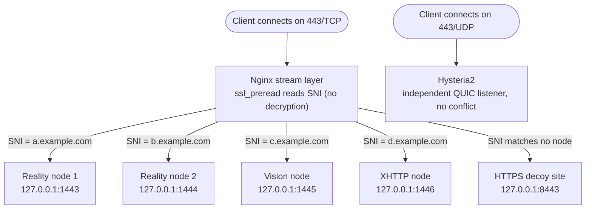

# JQ's Proxy Stack Manager

```
       _    ___          ____    ____    __  __
      | |  / _ \        |  _ \  / ___| |  \/  |
   _  | | | | | |       | |_) | \___ \ | |\/| |
  | |_| | | |_| |       |  __/   ___) | | |  | |
   \___/   \__\_|       |_|     |____/ |_|  |_|

  Proxy Stack Manager  ·····  ◆ jinqians.com
  ──────────────────────────────────────────
  IP    ▶  x.x.x.x              Nginx     ▶  1.x.x
  Xray  ▶  x.x.x                Hysteria2 ▶  2.x.x
  ──────────────────────────────────────────
```

---

## Introduction

**Proxy Stack Manager (PSM)** is an all-in-one Bash-based management tool for Linux proxy servers. The `psm` command lets you install VLESS Reality / Vision / XHTTP, Shadowsocks, Hysteria2, and Snell (v4 / v5 / v6) with a single command, and centrally manage Nginx, SSL certificates, per-node traffic monitoring with Telegram Bot notifications, VPS security hardening, Docker apps, and Cloudflare services.

Every node automatically generates its own key pair and can export share links and QR codes, with Clash Meta / Shadowrocket config export supported. Certificates are issued and renewed automatically via acme.sh — no manual steps required. Multiple protocol nodes can also share the same public port 443 (see below).

---

## 443 Port Reuse

Multiple protocol nodes can share the same public port 443 for external access — no need to open a separate port for every protocol or domain. This works via Nginx's `stream`-layer `ssl_preread`: it reads the SNI (the domain the client is trying to reach) straight out of the TLS ClientHello without decrypting the traffic, then routes the connection to the matching backend by domain.



Benefits:

- **Only one port exposed externally** — the firewall only needs to allow 443, shrinking the scannable attack surface
- **Multiple identities on one machine** — different protocol nodes, plus the decoy site shown to GFW probing, can all live on 443 at once, distinguished purely by domain name
- **Multiple tenants per node** — no need to open a separate port/key pair per user; multiple UUIDs under the same SNI share one entry point, with traffic billed independently per user
- **UDP 443 reuse is independent** — Hysteria2 runs over UDP, a completely separate listening stack from the TCP routing above, so there's no conflict even though the port number is the same

---

## How to Use

### One-line install

Run as root on your VPS. This installs to `/opt/psm` and registers the `psm` command:

```bash
# Using curl (recommended)
bash <(curl -fsSL https://psm.jinqians.com)

# Using wget (if curl isn't installed)
bash <(wget -qO- https://psm.jinqians.com)
```

> Re-running the same command on an already-installed machine just does a `git pull` update — it won't re-run the install wizard.

Once installed, just run:

```bash
psm
```

to open the interactive main menu.

### Manual install

```bash
git clone https://github.com/jinqians/proxy-stack.git /opt/psm
bash /opt/psm/install.sh
```

### System requirements

| Distro                  | Minimum version          |
| ----------------------- | ------------------------ |
| Ubuntu                  | 20.04 LTS or later       |
| Debian                  | 10 (Buster) or later     |
| CentOS / RHEL           | 8 or later               |
| Rocky Linux / AlmaLinux | 8 or later               |
| Oracle Linux            | 8 or later               |
| Amazon Linux            | 2 or later               |
| Fedora                  | recent supported release |

> Distros/versions outside this list (e.g. CentOS 7, Debian 9, Ubuntu 18.04 or older) are untested and not guaranteed to work.

| Item         | Requirement                                                                               |
| ------------ | ----------------------------------------------------------------------------------------- |
| Privilege    | root                                                                                      |
| Architecture | x86_64 · arm64                                                                           |
| Base deps    | `curl` or `wget` (either is enough) · `git` (installed automatically by bootstrap) |

All other dependencies (`jq`, `openssl`, `qrencode`, `unzip`, `iptables`, `fail2ban`, etc.) are installed on demand the first time each feature module needs them.

### Main menu

```
══════════════════════════════════════════════════════════════
                  JQ's Proxy Stack Manager
══════════════════════════════════════════════════════════════
   1. System Management            9. Cloudflare DDNS
   2. Nginx Management             10. Website Management
   3. Xray Management              11. View All Nodes
   4. Hysteria2 Management         12. Backup Management
   5. Snell Management             13. Restore Backup
   6. SS 2022 Management           14. Update PSM
   7. Docker Management            15. Traffic Management
   8. SSL Certificate Management   16. Telegram Bot
  17. Security Hardening
──────────────────────────────────────────────────────────────
   0. Exit
══════════════════════════════════════════════════════════════
```

### Non-interactive mode (for cron / systemd timers)

```bash
manager.sh --ddns-update           # run one Cloudflare DDNS update
manager.sh --backup-full           # run one full backup
manager.sh --backup-quick [tag]    # run one quick backup
manager.sh --update                # update PSM scripts and components
manager.sh --traffic-check         # run one traffic accounting check
manager.sh --tgbot                 # start the Telegram Bot daemon
manager.sh --reality-watchdog      # run one Reality decoy-target health check
manager.sh --honeypot-alert <ip> <port>  # honeypot hit alert (invoked by fail2ban)
manager.sh --health-report         # send one daily health report
```

These are the actual entry points that each feature module's scheduled task calls behind the scenes. The corresponding "enable scheduled task" option in each menu registers everything for you automatically — no manual cron setup needed.

### Uninstall

```bash
bash /opt/psm/uninstall.sh
```

Asks per-component whether to remove it; backup files are kept by default.

---

## Features

### Proxy protocols

- **Xray** — Reality / Vision / XHTTP / SS2022, multi-node management, automatic key-pair generation, export VLESS URI (with QR code) / Clash Meta / Sing-box
- **Reality multi-target auto-failover** — configure several candidate SNIs for the decoy target, run real TLS 1.3 handshake checks on a schedule, and auto-switch on failure while keeping existing client links working
- **Cloudflare WARP outbound unlock** — register a WARP identity and wire it into an Xray outbound with one click, then route traffic for Netflix/OpenAI-style domains through WARP via routing rules
- **Outbound routing** — custom outbound nodes (VLESS-Reality / TLS / XHTTP, Shadowsocks, Trojan, SOCKS5), forwarded by domain / GeoIP / GeoSite rule to the outbound you choose
- **Hysteria2** — UDP proxy, password auth, bandwidth limiting, masquerade
- **Snell** — v4 / v5 / v6, PSK auth, Surge-format export
- **SS 2022** — standalone shadowsocks-rust deployment, `ss://` URI export (with QR code)

### Core services

- **Nginx** — SNI-based multi-protocol routing, site management, HTTPS decoy sites
- **SSL certificates** — automatic issuance via acme.sh (HTTP-01 / DNS-01 wildcard), automatic renewal
- **Cloudflare** — dynamic DDNS updates, DNS record management, DNS-01 wildcard certificates
- **Cloudflare Tunnel** — expose local services (Docker apps, admin panels, etc.) on a domain without opening any ports
- **Cloudflare Access** — put an email-verification gate in front of domains exposed via Tunnel/Nginx, purpose-built for protecting admin surfaces like Portainer or Nginx Proxy Manager
- **Docker** — install & manage, one-click app store (Portainer / Uptime Kuma / Netdata / AdGuard Home / Vaultwarden / Alist, etc.), pre-deploy port-conflict detection, choice of exposure method (local only / direct public / Nginx reverse proxy / Cloudflare Tunnel), named volumes included in backups

### Security hardening

- **SSH hardening** — one-click switch to key-only login, disable password auth, change the listening port; every high-risk change is applied via `reload` (without cutting the current session) and protected by a 5-minute auto-rollback that reverts automatically if you don't confirm, so you can't lock yourself out
- **Fail2ban brute-force protection** — auto-bans on repeated SSH login failures, with a built-in "recidive" rule that hands out longer bans to repeat offenders, plus IP whitelisting
- **Honeypot traps** — sets traps on ports that shouldn't have any service running (RDP / MSSQL / Telnet, etc.); any connection to them is treated as reconnaissance/scanning and gets an automatic permanent ban plus a Telegram alert. Port-conflict detection automatically excludes SSH, already-configured proxy protocols, and Docker services, so legitimate services are never caught by mistake

### Operations & monitoring

- **Traffic management** — set a monthly traffic quota per node, auto-pause on threshold, per-minute accounting, automatic monthly reset
- **Expiry management** — set an expiry date per node, automatic reminders and auto-pause as it nears/reaches expiry, one-click renewal
- **Daily health report** — a scheduled Telegram digest covering traffic warnings, expiry reminders, Reality failover events, and SSH/BBR/Fail2ban/honeypot/WARP status — the whole picture in one message
- **Telegram Bot** — query node traffic, manage user bindings, renew before expiry, and pull the health report, all from within Telegram with no need to log into the server
- **Backup & restore** — full / selective backup (including Docker volumes), scheduled backups, one-click restore
- **System management** — BBR congestion control, sysctl network tuning, firewall, DNS, timezone

---

## Directory Structure

```
/opt/psm/
├── bootstrap.sh          # one-line install entry point
├── manager.sh            # main entry point (interactive menu + non-interactive calls)
├── install.sh            # first-run install wizard
├── update.sh             # self-update and component upgrades
├── uninstall.sh          # guided uninstaller
├── config/               # runtime state & config (gitignored)
├── lib/
│   ├── common.sh         # shared utility functions
│   ├── xray/             # Reality / Vision / XHTTP / SS2022 / WARP / outbound routing / health checks
│   ├── security/         # SSH hardening / Fail2ban / honeypot
│   ├── cloudflare/       # Tunnel / Access
│   ├── docker/           # Docker extensions such as volume backup
│   ├── tgbot/            # Telegram notification templates / daily health report
│   ├── expiry/           # expiry management
│   ├── hysteria2.sh / snell.sh / ssrust.sh
│   ├── nginx.sh / cert.sh / cloudflare.sh
│   ├── docker.sh / system.sh / backup.sh / traffic.sh
│   └── tg_bot.sh
├── templates/            # config templates (including the Docker app store)
└── backup/               # backup archives
```

---

## Donation

If this project has been useful to you, feel free to buy the author a coffee ☕️ — USDT donations welcome.

| Network           | Scan to donate | Address                                        |
| ----------------- | -------------- | ---------------------------------------------- |
| **TRC20**   |                | `TUe1x22n9FPAgLt6YFcQyxWgvTZFNgKBgM`         |
| **Polygon** |                | `0x5632f6d76a03543c53d750918c9c6a4c372f1597` |

Thanks to everyone who has supported this project!

---

## License

This project is licensed under the [GNU Affero General Public License v3.0 (AGPL-3.0)](LICENSE).
