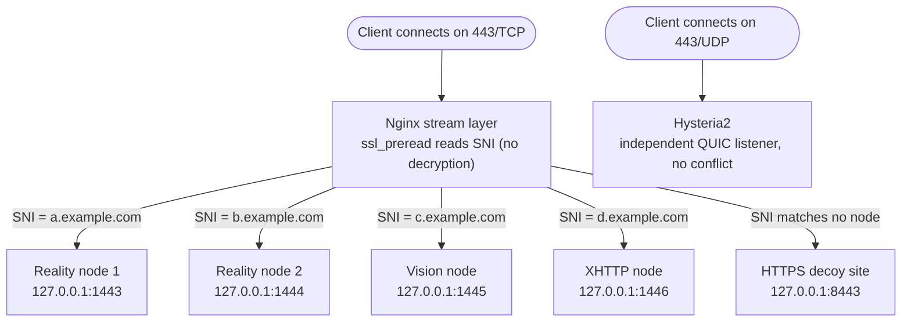

<div align="center">

# JQ's Proxy Stack Manager

**All-in-one Linux proxy server manager · dual Xray / sing-box cores**

<p>
  
  
  
  
  
</p>

<p>
  <a href="README.md">简体中文</a> ·
  <b>English</b> ·
  <a href="README_KO.md">한국어</a> ·
  <a href="README_RU.md">Русский</a>
</p>

</div>

```
       _    ___          ____    ____    __  __
      | |  / _ \        |  _ \  / ___| |  \/  |
   _  | | | | | |       | |_) | \___ \ | |\/| |
  | |_| | | |_| |       |  __/   ___) | | |  | |
   \___/   \__\_|       |_|     |____/ |_|  |_|

  Proxy Stack Manager  ·····  ◆ jinqians.com
  ──────────────────────────────────────────
  IP    ▶  x.x.x.x              Nginx     ▶  1.x.x
  Xray  ▶  x.x.x                Hysteria2 ▶  2.x.x
  ──────────────────────────────────────────
```

---

## Introduction

**Proxy Stack Manager (PSM)** is an all-in-one Bash-based management tool for Linux proxy servers. The `psm` command lets you install VLESS Reality / Vision / XHTTP, Shadowsocks, Hysteria2, Snell, and AnyTLS with a single command, powered by **dual Xray and sing-box cores**, and centrally manage Nginx, SSL certificates, realm relay forwarding, per-node traffic monitoring with Telegram Bot notifications, VPS security hardening, Docker apps, and Cloudflare services.

Every node automatically generates its own key pair and can export share links and QR codes, with Clash Meta / Shadowrocket / Surge config export supported. Certificates are issued and renewed automatically via acme.sh — no manual steps required. Multiple protocol nodes can also share the same public port 443 (see below).

The interface is available in **four languages — 简体中文 / English / 한국어 / Русский** — chosen at install time and switchable any time from the main menu.

### Why PSM

- **One command to enter the full management menu** — after installation, just run `psm`
- **Dual cores** — Xray and sing-box are managed side by side: protocol inbounds, routing rules, and outbounds are configured independently per core without interfering
- **Multi-protocol management** — Reality / Vision / XHTTP / Hysteria2 / Snell / SS2022 / AnyTLS can coexist under one workflow, no per-protocol scripts to maintain
- **Designed for long-lived VPS instances** — not a one-off installer, but a tool that keeps update, backup, restore, service status, and hardening in one place
- **Four-language interface** — switch between Chinese / English / Korean / Russian any time; `PSM_LANG=en psm` overrides per session
- **Transparent and auditable** — the project is Bash-based, installs under `/opt/psm`, and documents its system write paths

---

## 443 Port Reuse

Multiple protocol nodes can share the same public port 443 for external access — no need to open a separate port for every protocol or domain. This works via Nginx's `stream`-layer `ssl_preread`: it reads the SNI (the domain the client is trying to reach) straight out of the TLS ClientHello without decrypting the traffic, then routes the connection to the matching backend by domain.


```mermaid
flowchart TD
    A(["Client connects on 443/TCP"]) --> B["Nginx stream layer<br/>ssl_preread reads SNI (no decryption)"]

    B -->|"SNI = a.example.com"| C1["Reality node 1<br/>127.0.0.1:1443"]
    B -->|"SNI = b.example.com"| C2["Reality node 2<br/>127.0.0.1:1444"]
    B -->|"SNI = c.example.com"| D["Vision node<br/>127.0.0.1:1445"]
    B -->|"SNI = d.example.com"| E["XHTTP node<br/>127.0.0.1:1446"]
    B -->|"SNI matches no node"| F["HTTPS decoy site<br/>127.0.0.1:8443"]

    G(["Client connects on 443/UDP"]) --> H["Hysteria2<br/>independent QUIC listener, no conflict"]
```

Benefits:

- **Only one port exposed externally** — the firewall only needs to allow 443, shrinking the scannable attack surface
- **Multiple identities on one machine** — different protocol nodes, plus the decoy site shown to GFW probing, can all live on 443 at once, distinguished purely by domain name
- **Multiple tenants per node** — no need to open a separate port/key pair per user; multiple UUIDs under the same SNI share one entry point, with traffic billed independently per user
- **UDP 443 reuse is independent** — Hysteria2 runs over UDP, a completely separate listening stack from the TCP routing above, so there's no conflict even though the port number is the same

---

## How to Use

### One-line install

Run as root on your VPS. This installs to `/opt/psm` and registers the `psm` command:

```bash
# Using curl (recommended)
bash <(curl -fsSL https://psm.jinqians.com)

# Using wget (if curl isn't installed)
bash <(wget -qO- https://psm.jinqians.com)
```

> Running the same command again on a fully installed machine performs a `git pull` update. If a half-installed state left over from an old uninstall is detected, the installer re-runs automatically to repair it.

After installation, type at any time:

```bash
psm
```

to enter the interactive main menu.

### Manual install

```bash
git clone https://github.com/jinqians/proxy-stack.git /opt/psm
bash /opt/psm/install.sh
```

### System requirements

| Distribution            | Minimum supported version |
| ----------------------- | ------------------------- |
| Ubuntu                  | 20.04 LTS or later        |
| Debian                  | 10 (Buster) or later      |
| CentOS / RHEL           | 8 or later                |
| Rocky Linux / AlmaLinux | 8 or later                |
| Oracle Linux            | 8 or later                |
| Amazon Linux            | 2 or later                |
| Fedora                  | recent supported releases |

> Systems not in this list, or older versions (CentOS 7, Debian 9, Ubuntu 18.04 and earlier), are untested and not guaranteed to work.

| Item          | Requirement                                                            |
| ------------- | ---------------------------------------------------------------------- |
| Privileges    | root                                                                    |
| Architecture  | x86_64 · arm64                                                         |
| Base packages | `curl` or `wget` (either one) · `git` (installed by bootstrap) |

Other dependencies (`jq`, `openssl`, `qrencode`, `unzip`, `iptables`, `fail2ban`, …) are installed on demand the first time each feature module is used.

### Main menu

```
══════════════════════════════════════════════════════════════
                  JQ's Proxy Stack Manager
══════════════════════════════════════════════════════════════
   1. System Management        11. Relay (realm)
   2. sing-box Management      12. Cloudflare DDNS
   3. Xray Management          13. Docker Management
   4. Snell Management         14. Traffic Management
   5. ss-rust Management       15. Telegram Bot
   6. Hysteria2 Management     16. Backup Management
   7. Nginx Management         17. Restore Backup
   8. Website Management       18. Update PSM
   9. SSL Cert Management      19. Security Hardening
  10. View All Nodes           20. 语言 / Language
──────────────────────────────────────────────────────────────
   0. Exit
══════════════════════════════════════════════════════════════
```

### Non-interactive mode (for cron / systemd timers)

```bash
manager.sh --ddns-update           # Run one Cloudflare DDNS update
manager.sh --backup-full           # Run one full backup
manager.sh --backup-quick [label]  # Run one quick backup
manager.sh --update                # Update PSM scripts and components
manager.sh --traffic-check         # Run one traffic accounting check
manager.sh --tgbot                 # Start the Telegram Bot daemon
manager.sh --reality-watchdog      # Run one Reality decoy liveness check
manager.sh --honeypot-alert <ip> <port>  # Honeypot hit alert (called by fail2ban)
manager.sh --health-report         # Send one daily health report
```

These are the real entry points invoked by each module's scheduled tasks. The "enable scheduled task" options in the menus register them for you — no manual cron setup needed.

### Uninstall

```bash
bash /opt/psm/uninstall.sh
```

The uninstaller removes the shortcut command, cron entries, systemd timers/services, and PSM firewall/Fail2ban rules created by PSM itself, and asks (default yes) whether to delete the `/opt/psm` program directory with its config state. Components such as Nginx, Xray, sing-box, Hysteria2, Snell, ss-rust, acme.sh, certificates, and Docker Compose apps are confirmed one by one, so services you maintain manually are never removed by accident.

---

## Features

### Xray core

- **Xray** — Reality / Vision / XHTTP / SS2022, multi-node management, automatic key pair generation, VLESS URI export (with QR code) / Clash Meta / sing-box
- **Reality multi-target liveness switching** — configure multiple candidate SNIs for the decoy target; periodic real TLS 1.3 handshake checks switch away from dead targets automatically while old client links keep working
- **Smart Reality decoy discovery** — when configuring a Reality / XHTTP decoy SNI, cyberspace mapping engines (Netlas / Quake / ZoomEye / FOFA, using your own API key, free tiers suffice) can discover real TLS 1.3 sites in the **same ASN / same datacenter** as your server: nearby, obscure, and free of the over-used big-brand domains. Candidates are verified locally with real handshakes (TLS 1.3 / X25519 / certificate match) before being adopted, and can be batch-added to the liveness pool above. **No local port scanning at any point** (avoiding provider abuse reports) — discovery relies on the engines' datasets; without an engine configured, it falls back to manual input
- **Cloudflare WARP outbound unlock** — register a WARP identity with one click and wire it into Xray outbounds; combined with routing rules, traffic for Netflix / OpenAI etc. is steered through WARP
- **Outbound routing** — custom outbound nodes (VLESS-Reality / TLS / XHTTP, Shadowsocks, Trojan, SOCKS5), forwarding by domain / GeoIP / GeoSite rules to a chosen outbound

### sing-box core (second core)

- **A full protocol stack parallel to Xray** — VLESS Reality, SS2022, Hysteria2, AnyTLS (requires sing-box 1.12+), and Snell (requires sing-box 1.14+) inbounds sharing one kernel and one config file
- **Routing management** — geosite / geoip / domain suffix / IP CIDR / inbound tag → chosen outbound or reject, with one-tap ad-block and QUIC-block presets
- **Outbound manager** — 10 outbound types: ss / vless-reality / vless-tls / trojan / socks / anytls / snell / hysteria2 (Salamander obfuscation) / tuic
- **WARP outbound** — reuses the WARP account registered on the Xray side as a WireGuard endpoint
- **Transactional config changes** — every change is preceded by an automatic backup; if `sing-box check` fails, both the config and the node store are rolled back, so a bad config can never take the service down

### Standalone protocols & relay

- **Hysteria2** — UDP proxy, password auth, bandwidth limits, masquerade
- **Snell** — v4 / v5 / v6, PSK auth, Surge-format export
- **SS 2022** — standalone shadowsocks-rust deployment, `ss://` URI export (with QR code)
- **realm relay** — TCP / UDP port forwarding rule management (relay machine → landing machine), with relay server status reports via Telegram

### Base services

- **Nginx** — SNI-based multi-protocol routing, site management, HTTPS decoy sites
- **SSL certificates** — automatic issuance via acme.sh (HTTP-01 / DNS-01 wildcard), automatic renewal
- **Cloudflare** — dynamic DDNS updates, DNS record management, DNS-01 wildcard certificates
- **Cloudflare Tunnel** — expose local services (Docker apps, admin panels, …) on a chosen domain without opening any port
- **Cloudflare Access** — put an email-verification gate in front of domains exposed via Tunnel/Nginx, made for protecting admin apps like Portainer and Nginx Proxy Manager
- **Docker** — install management, one-click app store (Portainer / Uptime Kuma / Netdata / AdGuard Home / Vaultwarden / Alist, …), pre-deploy port conflict detection, selectable exposure (localhost only / direct public / Nginx reverse proxy / Cloudflare Tunnel), data volumes included in backups

### Security hardening

- **SSH hardening** — one-click key-only login, password auth disabling, and port changes; every high-risk change is applied via `reload` (never killing your current session) with a 5-minute auto-rollback that reverts unless confirmed, so you can't lock yourself out
- **Fail2ban** — automatic banning of failed SSH logins, built-in "recidive" rules imposing longer bans on repeat offenders, IP whitelist support
- **Honeypot** — traps on ports this machine shouldn't be serving (RDP / MSSQL / Telnet, …); any connection is treated as reconnaissance, triggering a permanent ban and a Telegram alert. Port occupancy detection automatically excludes SSH, configured proxy protocols, Docker services, etc., so legitimate services are never caught

### Operations & monitoring

- **Traffic management** — monthly quota per node, automatic pause at threshold, per-minute accounting, automatic monthly reset
- **Expiry management** — per-node expiry dates, automatic reminders and service pause on expiry, one-click renewal
- **Daily health report** — a scheduled Telegram digest: traffic warnings, expiry reminders, Reality liveness switches, SSH/BBR/Fail2ban/honeypot/WARP status — the whole picture in one message
- **Telegram Bot** — query node traffic, manage user bindings, renew expiries, health reports — all from inside Telegram, no server login needed
- **Backup & restore** — full / selective backups (including Docker volumes), scheduled backups, one-click restore
- **System management** — BBR congestion control, sysctl network tuning, firewall, DNS, timezone
- **Multilingual interface** — 简体中文 / English / 한국어 / Русский; chosen at install, switchable from the menu, with all 2000+ interface strings fully translated

---

## Directory Layout

```
/opt/psm/
├── bootstrap.sh          # One-line install entry
├── manager.sh            # Main entry (interactive menu + non-interactive calls)
├── install.sh            # First-install wizard
├── update.sh             # Self-update and component upgrades
├── uninstall.sh          # Guided uninstaller
├── config/               # Runtime state and config (gitignored)
├── lang/                 # Language tables (zh / en / ko / ru)
├── lib/
│   ├── common.sh         # Shared utilities
│   ├── i18n.sh           # Multilingual framework
│   ├── xray/             # Reality / Vision / XHTTP / SS2022 / WARP / outbound routing / liveness / decoy discovery
│   ├── singbox/          # sing-box second core (Reality / SS2022 / Hysteria2 / AnyTLS / Snell / routing)
│   ├── security/         # SSH hardening / Fail2ban / honeypot
│   ├── cloudflare/       # Tunnel / Access
│   ├── docker/           # Docker extensions (volume backup, …)
│   ├── tgbot/            # Telegram notification templates / daily health report / relay status
│   ├── expiry/           # Expiry management
│   ├── hysteria2.sh / snell.sh / ssrust.sh / realm.sh
│   ├── nginx.sh / cert.sh / cloudflare.sh
│   ├── docker.sh / system.sh / backup.sh / traffic.sh
│   └── tg_bot.sh
├── scripts/              # Dev helper scripts (i18n checks, …)
├── templates/            # Config templates (incl. Docker app store templates)
└── backup/               # Backup archives
```

---

## Write Paths

PSM keeps its own state under `/opt/psm` as much as possible, but some features must write system services, certificates, firewall rules, or app configs. Common paths:

| Path                                                                        | Purpose                                                    |
| --------------------------------------------------------------------------- | ---------------------------------------------------------- |
| `/opt/psm`                                                                | PSM program, runtime state, config, backups, Docker Compose projects |
| `/usr/local/bin/psm`                                                      | Global shortcut command                                    |
| `/etc/systemd/system/psm-*.service` / `/etc/systemd/system/psm-*.timer` | PSM scheduled tasks and daemons                            |
| `/usr/local/etc/xray` / `/usr/local/bin/xray`                           | Xray config and binary                                     |
| `/etc/sing-box` / `/usr/local/bin/sing-box`                             | sing-box config and binary                                 |
| `/etc/hysteria` / `/usr/local/bin/hysteria`                             | Hysteria2 config and binary                                |
| `/etc/realm` / `/usr/local/bin/realm`                                   | realm relay config and binary                              |
| `/etc/nginx`                                                              | Nginx sites, stream routing, and SSL files                 |
| `/root/.acme.sh`                                                          | acme.sh account and certificate issuance cache             |
| `/etc/fail2ban` / `iptables`                                            | Fail2ban rules, honeypot, and traffic accounting chains    |
| `/etc/cron.d/psm-*`                                                       | Cron entries for backup, DDNS, etc.                        |

If you plan to use PSM on a production VPS, read the install output and uninstall prompts first; if the machine already carries important Nginx, Docker, or Cloudflare Tunnel configs, take a snapshot or manual backup beforehand.

---

## FAQ

### How do I switch the interface language?

Pick "20. 语言 / Language" in the main menu to switch between 简体中文 / English / 한국어 / Русский; the choice is persisted. `PSM_LANG=en psm` overrides the language for a single session.

### What happens if I run the one-line install again?

If `/opt/psm` is a complete installation, the script performs a `git pull` update. If it detects a half-installed state left over from an old uninstall (e.g. `.git` present but the `psm` command or config directory missing), it automatically re-runs the install flow to repair it.

### Xray vs sing-box — which should I use?

They are independent, parallel cores. The Xray side has the richest tooling (liveness watchdog, decoy discovery, traffic accounting); the sing-box side covers more protocols (AnyTLS, native Snell inbound) with a more modern routing config. Use either one, or run both at once — each manages its own ports and nodes.

### Why does the uninstaller let me keep certain components?

Nginx, Docker, certificates, Cloudflare Tunnel, etc. may be shared with other sites or services. The uninstaller removes PSM's own traces by default and confirms each shared component one by one.

### Will it overwrite my existing Nginx configuration?

PSM manages its own sites and stream routing configs. If you have production sites, back up `/etc/nginx` first and double-check domains, ports, and certificate paths before menu operations.

### Can I install without root?

No. PSM installs system packages and writes to systemd, and manages Nginx, certificates, firewall, and proxy services — root is required.

### Is it suitable for managing many servers centrally?

PSM currently focuses on local management of a single VPS — no central panel, state sync, or remote orchestration. realm relay can forward traffic between machines, but each machine is still managed independently.

---

## Project Links

- [简体中文 README](README.md) · [한국어 README](README_KO.md) · [Русский README](README_RU.md)
- [Changelog](CHANGELOG.md)

---

## Donate

If this project helps you, consider buying the author a coffee ☕️ — USDT appreciated.

| Network           | QR       | Address                                        |
| ----------------- | -------- | ---------------------------------------------- |
| **TRC20**   |          | `TUe1x22n9FPAgLt6YFcQyxWgvTZFNgKBgM`         |
| **Polygon** |          | `0x5632f6d76a03543c53d750918c9c6a4c372f1597` |

Thanks to every supporter!

---

## License

This project is released under the [GNU Affero General Public License v3.0 (AGPL-3.0)](LICENSE).
