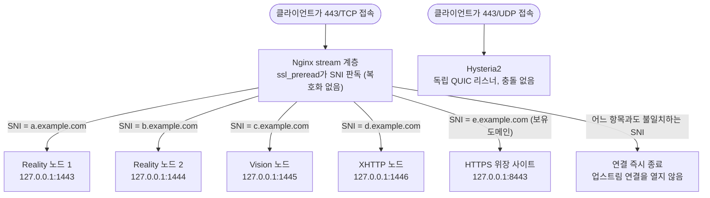

<div align="center">

# JQ's Proxy Stack Manager

**올인원 Linux 프록시 서버 관리 도구 · Xray / sing-box / mihomo 트리플 코어**

<p>
  
  
  
  
  
</p>

<p>
  <a href="README.md">简体中文</a> ·
  <a href="README_EN.md">English</a> ·
  <b>한국어</b> ·
  <a href="README_RU.md">Русский</a>
</p>

</div>

```
       _    ___          ____    ____    __  __
      | |  / _ \        |  _ \  / ___| |  \/  |
   _  | | | | | |       | |_) | \___ \ | |\/| |
  | |_| | | |_| |       |  __/   ___) | | |  | |
   \___/   \__\_|       |_|     |____/ |_|  |_|

  Proxy Stack Manager  ·····  ◆ jinqians.com
  ──────────────────────────────────────────
  IP    ▶  x.x.x.x              Nginx     ▶  1.x.x
  Xray  ▶  x.x.x                Hysteria2 ▶  2.x.x
  Sing-box ▶  x.x.x             Mihomo    ▶  v1.x.x
  ──────────────────────────────────────────
```

---

## 소개

**Proxy Stack Manager(PSM)** 는 Bash 기반의 Linux 프록시 서버 올인원 관리 도구입니다. `psm` 명령 하나로 VLESS Reality / Vision / XHTTP, Shadowsocks, Hysteria2, Snell, AnyTLS 등 다양한 프록시 프로토콜을 설치할 수 있으며, **Xray, sing-box, mihomo(Clash.Meta) 트리플 코어**를 내장하고 Nginx, SSL 인증서, realm 중계 전달, 노드별 트래픽 모니터링과 Telegram 봇 알림, VPS 보안 강화, Docker 앱, Cloudflare 서비스까지 통합 관리합니다.

모든 노드는 키 쌍을 자동 생성하고 공유 링크와 QR 코드를 내보낼 수 있으며, Clash Meta / Shadowrocket / Surge 설정 내보내기를 지원합니다. 인증서는 acme.sh로 자동 발급·갱신되므로 수동 작업이 필요 없습니다. 여러 프로토콜 노드가 동일한 443 포트를 공유해 외부에 노출될 수도 있습니다(아래 참조).

인터페이스는 **简体中文 / English / 한국어 / Русский** 4개 언어를 지원합니다. 설치 시 선택하고, 메인 메뉴에서 언제든 전환할 수 있습니다.

### PSM을 선택하는 이유

- **명령 하나로 전체 관리 메뉴 진입**: 설치 후 `psm`만 실행하면 모든 기능이 하나의 CLI 메뉴 안에 있습니다
- **트리플 코어 선택 가능**: Xray, sing-box, mihomo 세 코어를 나란히 관리하며, 프로토콜 인바운드·라우팅·아웃바운드를 코어별로 독립 구성해 서로 간섭하지 않습니다
- **멀티 프로토콜 통합 관리**: Reality / Vision / XHTTP / Hysteria2 / Snell / SS2022 / AnyTLS가 공존할 수 있어 프로토콜마다 별도 스크립트를 유지할 필요가 없습니다
- **장기 운영 VPS에 적합**: 일회성 설치 스크립트가 아니라 업데이트, 백업, 복원, 서비스 상태, 보안 강화를 하나의 도구에 담았습니다
- **4개 언어 인터페이스**: 중국어 / 영어 / 한국어 / 러시아어를 언제든 전환, `PSM_LANG=ko psm`으로 세션별 임시 지정도 가능
- **투명하고 감사 가능**: 프로젝트 본체는 Bash 스크립트이며 설치 경로는 `/opt/psm`으로 고정, 시스템 기록 경로를 문서에 명시합니다

---

## 443 포트 재사용

여러 프로토콜 노드가 동일한 공인 443 포트를 공유해 외부에 노출될 수 있습니다 — 프로토콜/도메인마다 별도 포트를 열 필요가 없습니다. 원리는 Nginx `stream` 계층의 `ssl_preread`입니다. 트래픽을 복호화하지 않은 채 TLS ClientHello에서 SNI(클라이언트가 접속하려는 도메인)를 읽어, 도메인별로 해당 백엔드에 분배합니다.



장점:

- **외부에 포트 하나만 노출**: 방화벽은 443만 허용하면 되므로 스캔 가능한 공격 표면이 줄어듭니다
- **알 수 없는 SNI는 즉시 차단**: 분배 표는 명시적으로 등록된 도메인만 인식하므로, 스캐너가 아무 SNI나 넣어 들어오면 업스트림 연결을 전혀 열지 않고 끊어냅니다 — 이 블랙홀은 서버가 무료 중계로 쓰이는 경로까지 함께 막습니다(자주 묻는 질문의 CDN 위장 대상 항목 참고)
- **한 서버에 여러 정체성**: 서로 다른 프로토콜 노드와 GFW 탐지용 위장 사이트를 동시에 443에 올리고, 도메인만으로 구분되어 서로 간섭하지 않습니다
- **한 노드에 여러 테넌트**: 사용자마다 별도 포트/키를 열 필요 없이, 같은 SNI 아래 여러 UUID가 입구를 공유하며 트래픽은 각자 독립 정산됩니다
- **UDP 443은 독립 재사용**: Hysteria2는 UDP 기반으로, 위의 TCP 분배와는 완전히 별개의 리스닝 스택이라 포트 번호가 같아도 충돌하지 않습니다

---

## 사용 방법

### 원라인 설치

VPS에서 root로 실행하면 `/opt/psm`에 자동 설치되고 `psm` 명령이 등록됩니다:

```bash
# curl 사용 (권장)
bash <(curl -fsSL https://psm.jinqians.com)

# wget 사용 (curl이 없을 때)
bash <(wget -qO- https://psm.jinqians.com)
```

> 완전히 설치된 머신에서 같은 명령을 다시 실행하면 자동으로 `git pull` 업데이트가 수행됩니다. 이전 버전 제거 후 남은 반설치 상태가 감지되면 설치 흐름을 자동으로 다시 실행해 복구합니다.

설치가 끝나면 언제든지:

```bash
psm
```

을 입력해 대화형 메인 메뉴로 들어갑니다.

### 수동 설치

```bash
git clone https://github.com/jinqians/proxy-stack.git /opt/psm
bash /opt/psm/install.sh
```

### 시스템 요구 사항

| 배포판                  | 최소 지원 버전       |
| ----------------------- | -------------------- |
| Ubuntu                  | 20.04 LTS 이상       |
| Debian                  | 10 (Buster) 이상     |
| CentOS / RHEL           | 8 이상               |
| Rocky Linux / AlmaLinux | 8 이상               |
| Oracle Linux            | 8 이상               |
| Amazon Linux            | 2 이상               |
| Fedora                  | 최신 지원 릴리스     |

> 목록에 없거나 더 오래된 시스템(CentOS 7, Debian 9, Ubuntu 18.04 이하)은 테스트되지 않았으며 동작을 보장하지 않습니다.

| 항목        | 요구 사항                                                        |
| ----------- | ----------------------------------------------------------------- |
| 실행 권한   | root                                                               |
| 아키텍처    | x86_64 · arm64                                                    |
| 기본 의존성 | `curl` 또는 `wget`(하나만 있으면 됨) · `git`(bootstrap이 자동 설치) |

기타 의존성(`jq`, `openssl`, `qrencode`, `unzip`, `iptables`, `fail2ban` 등)은 각 기능 모듈을 처음 사용할 때 필요에 따라 자동 설치됩니다.

### 메인 메뉴

```
══════════════════════════════════════════════════════════════
                  JQ's Proxy Stack Manager
══════════════════════════════════════════════════════════════
   1. 시스템 관리             12. 중계 (realm)
   2. sing-box 관리           13. Cloudflare DDNS
   3. mihomo 코어             14. Docker 관리
   4. Xray 관리               15. 트래픽 관리
   5. Snell 관리              16. Telegram 봇
   6. ss-rust 관리            17. 백업 관리
   7. Hysteria2 관리          18. 백업 복원
   8. Nginx 관리              19. PSM 업데이트
   9. 웹사이트 관리           20. 보안 강화
  10. SSL 인증서 관리         21. 언어 / Language
  11. 모든 노드 보기
──────────────────────────────────────────────────────────────
   0. 종료
══════════════════════════════════════════════════════════════
```

### 비대화형 모드 (cron / systemd 타이머용)

```bash
manager.sh --ddns-update           # Cloudflare DDNS 업데이트 1회 실행
manager.sh --backup-full           # 전체 백업 1회 실행
manager.sh --backup-quick [라벨]   # 빠른 백업 1회 실행
manager.sh --update                # PSM 스크립트 및 컴포넌트 업데이트
manager.sh --traffic-check         # 트래픽 통계 점검 1회 실행
manager.sh --tgbot                 # Telegram 봇 데몬 시작
manager.sh --reality-watchdog      # Reality 위장 대상 생존 점검 1회 실행
manager.sh --vpngate-watchdog      # VPNGate 가정용 터널 1회 점검, 끊겼으면 노드 자동 교체
manager.sh --ruleset-update        # 구독형 규칙셋 1회 갱신 (Xray는 내용이 바뀌면 재시작)
manager.sh --honeypot-alert <ip> <port>  # 허니팟 적중 알림 (fail2ban이 호출)
manager.sh --health-report         # 일일 점검 리포트 1회 발송
```

이들은 각 기능 모듈의 예약 작업이 실제로 호출하는 진입점입니다. 메뉴의 "예약 작업 활성화" 옵션이 자동으로 등록해 주므로 cron을 수동으로 설정할 필요가 없습니다.

### 제거

```bash
bash /opt/psm/uninstall.sh
```

제거 프로그램은 PSM이 만든 단축 명령, cron, systemd 타이머/서비스, PSM 방화벽/Fail2ban 규칙을 정리하고, `/opt/psm` 프로그램 디렉터리와 설정 상태 삭제 여부를 기본으로 물어봅니다. Nginx, Xray, sing-box, mihomo, Hysteria2, Snell, ss-rust, acme.sh, 인증서, Docker Compose 앱 등은 하나씩 확인하므로 수동으로 유지하는 시스템 서비스를 실수로 지우지 않습니다.

---

## 기능

### Xray 코어

- **Xray** — Reality / Vision / XHTTP / SS2022, 멀티 노드 관리, 키 쌍 자동 생성, VLESS URI(QR 코드 포함) / Clash Meta / sing-box 내보내기
- **Reality 다중 대상 자동 생존 전환** — 위장 대상에 여러 후보 SNI를 구성하고 주기적으로 실제 TLS 1.3 핸드셰이크를 검사, 죽은 대상은 자동 전환되며 기존 클라이언트 링크는 계속 유효합니다
- **Reality 위장 도메인 지능형 발견** — Reality / XHTTP 위장 SNI 구성 시 사이버 공간 매핑 엔진(Netlas / Quake / ZoomEye / FOFA, 본인 API 키 사용, 무료 한도로 충분)을 통해 본 서버와 **같은 ASN / 같은 데이터센터**의 실제 TLS 1.3 사이트를 위장 대상으로 자동 발견: 가깝고, 잘 알려지지 않았으며, 튜토리얼에서 남용된 대기업 도메인을 피합니다. 같은 ASN의 호스트는 CDN 엣지가 아니므로 자주 묻는 질문에서 다루는 무단 사용 위험도 자연히 비켜갑니다. 후보는 로컬에서 실제 핸드셰이크 검증(TLS 1.3 / X25519 / 인증서 일치)을 통과해야 채택되며, 위의 생존 후보 풀에 일괄 추가할 수 있습니다. **로컬 포트 스캔은 전혀 하지 않고**(제공업체 abuse 신고 방지) 발견은 매핑 엔진의 데이터셋으로 수행되며, 엔진 미구성 시 수동 입력으로 대체됩니다
- **Cloudflare WARP 아웃바운드 언락** — 원클릭으로 WARP 계정을 등록해 Xray 아웃바운드에 연결, 분배 규칙과 조합해 Netflix / OpenAI 등 도메인 트래픽을 WARP로 유도
- **VPNGate 가정용 IP 출구** — VPNGate 공개 목록에서 진짜 가정용 광대역 IP를 선별하고(ip-api 일괄 판정으로 데이터센터와 VPNGate 자체 릴레이 제외), openvpn으로 전용 터널을 올린 뒤 fwmark 아웃바운드로 분배 규칙에 연결합니다. Netflix / ChatGPT처럼 IP 소속으로 판단하는 서비스에는 가정용 출구가 보이고, 서버 자체의 기본 경로와 SSH는 전혀 영향받지 않습니다(터널은 전용 라우팅 테이블만 사용). 터널이 끊기면 해당 트래픽은 데이터센터 IP로 새지 않고 그대로 실패하며, 선택한 **같은 국가 안에서** 자동으로 장애 조치되므로 출구 국가가 몰래 바뀌지 않습니다(국가는 실제 노드가 있는 목록에서 직접 고릅니다). Xray / sing-box / mihomo가 터널 하나를 공유하므로 가정용 IP를 바꿔도 코어 설정은 그대로입니다
- **구독형 규칙셋** — 커뮤니티 규칙 목록 URL(OpenAI.list 등)을 붙여넣고 출구를 고르면 해당 트래픽이 그 출구로 나갑니다. Xray에는 규칙셋 기능이 없어 규칙이 `config.json`에 인라인으로 전개되며(도메인과 IP는 두 규칙으로 분리 — 한 규칙 안의 필드는 AND라서 합치면 절대 매칭되지 않습니다), 그래서 세 코어 중 유일하게 재시작이 필요합니다. 매일 갱신은 내용이 실제로 바뀐 경우에만 재빌드·재시작합니다
- **아웃바운드 분배** — 사용자 정의 아웃바운드 노드(VLESS-Reality / TLS / XHTTP, Shadowsocks, Trojan, SOCKS5), 도메인 / GeoIP / GeoSite 규칙으로 지정 아웃바운드로 전달

### sing-box 코어 (두 번째 코어)

- **Xray와 병행하는 완전한 프로토콜 스택** — VLESS Reality, SS2022, Hysteria2, AnyTLS(sing-box 1.12+ 필요), Snell(sing-box 1.14+ 필요) 인바운드가 하나의 커널과 설정 파일을 공유
- **Xray 안정 채널과 프리뷰 채널** — XTLS는 v26.3.27 이후 모든 릴리스를 prerelease로 표시해 안정 채널이 몇 달씩 뒤처질 수 있으며, 프리뷰 채널은 최신 빌드를 받습니다. 프리뷰 선택 시 v26.4.13부터 REALITY가 v26.3.27보다 오래된 코어의 클라이언트(많은 모바일 앱 내장 코어 포함)를 거부한다는 점을 안내하며, Reality 메뉴에서 노드별로 완화할 수 있습니다
- **안정 채널과 프리뷰 채널** — 설치 및 업그레이드 시 커널 채널을 선택할 수 있습니다. 기본값은 안정 버전이며, 프리뷰는 최신 beta/rc를 설치해 아직 정식화되지 않은 프로토콜에 접근하는 유일한 방법입니다(Snell 인바운드는 1.14+ 필요, 1.14는 아직 beta). Snell 노드가 있는 상태에서 안정 채널로 되돌리면 설명과 함께 차단되어 설정 검증 실패로 서비스가 멈추는 상황을 막습니다
- **라우팅 분배 관리** — geosite / geoip / 도메인 접미사 / IP CIDR / 인바운드 태그 → 지정 아웃바운드 또는 차단, 원탭 광고 차단·QUIC 차단 프리셋 내장
- **아웃바운드 노드 관리** — ss / vless-reality / vless-tls / trojan / socks / anytls / snell / hysteria2(Salamander 난독화) / tuic 등 10종 아웃바운드
- **WARP 아웃바운드** — Xray 측에 등록된 WARP 계정을 재사용해 WireGuard 엔드포인트로 원클릭 연결
- **구독형 규칙셋** — 커뮤니티 규칙 목록 URL(OpenAI.list 등)을 붙여넣고 출구를 고르면 해당 트래픽이 그 출구로 나갑니다. 네이티브 `rule_set`(로컬 source 파일, 1.10+ 자동 재적재)을 쓰므로 갱신 시 재시작이 없습니다. 적용 전 점검 리포트로 사용 가능 개수와 버려진 클라이언트 전용 유형(PROCESS-NAME 등)을 모두 알려주고, 갱신 시 규칙 수를 비교해 급변은 확인 전까지 거부합니다
- **VPNGate 가정용 출구** — Xray와 동일한 가정용 터널을 공유하며 아웃바운드는 `direct` + `routing_mark`라 노드를 바꿔도 설정 변경이 없습니다(sing-box 1.12+는 `domain_resolver`로 IPv4 고정)
- **트랜잭션형 설정 변경** — 변경 전 자동 백업, `sing-box check` 검증 실패 시 설정과 노드 저장소를 자동 롤백해 잘못된 설정이 서비스 기동을 막는 일이 없습니다

### mihomo 코어 (세 번째 코어)

- **Clash.Meta 생태계 접속** — VLESS Reality, SS2022, Hysteria2, AnyTLS, Snell v4/v5 인바운드가 `/etc/mihomo/config.yaml`을 공유합니다
- **Clash 방식 라우팅** — `proxies` / `proxy-groups` / `rules`를 직접 관리하며 DOMAIN-SUFFIX / DOMAIN-KEYWORD / GEOSITE / GEOIP / IP-CIDR / IN-NAME을 지원하고 `MATCH,DIRECT`를 고정 fallback으로 둡니다
- **아웃바운드 노드 관리** — ss / vless-reality / vless-tls / trojan / socks5 / anytls / snell / hysteria2 / tuic / wireguard 등 아웃바운드 유형 지원
- **WARP 아웃바운드 재사용** — Xray 측에 등록된 WARP 계정을 재사용해 mihomo wireguard proxy를 생성합니다
- **구독형 규칙셋** — mihomo 쪽은 네이티브 `rule-providers`로 생성되어 코어가 interval 마다 스스로 갱신합니다. `IP-ASN`처럼 mihomo만 지원하는 유형도 그대로 살아 있습니다
- **VPNGate 가정용 출구** — Xray와 동일한 가정용 터널을 공유하며 `type: direct` + `routing-mark` + `ip-version: ipv4` 프록시를 생성합니다. 노드 교체 시 설정 변경 불필요
- **트랜잭션형 설정 변경** — 변경마다 설정을 재생성하고 `mihomo -t -d /etc/mihomo -f /etc/mihomo/config.yaml`을 실행합니다. 검사 실패 시 자동 롤백되어 실행 중인 기존 설정에는 영향을 주지 않습니다

### 독립 프로토콜 및 중계

- **Hysteria2** — UDP 프록시, 비밀번호 인증, 대역폭 제한, masquerade 위장
- **Snell** — v4 / v5 / v6, PSK 인증, Surge 형식 내보내기
- **SS 2022** — shadowsocks-rust 독립 배포, `ss://` URI 내보내기(QR 코드 포함)
- **realm 중계** — TCP / UDP 포트 전달 규칙 관리(중계 서버 → 랜딩 서버), 중계 서버 상태를 Telegram으로 리포트

### 기본 서비스

- **Nginx** — SNI 멀티 프로토콜 분배, 사이트 관리, HTTPS 위장 사이트
- **SSL 인증서** — acme.sh 자동 발급(HTTP-01 / DNS-01 와일드카드), 자동 갱신
- **Cloudflare** — DDNS 동적 업데이트, DNS 레코드 관리, DNS-01 와일드카드 인증서
- **Cloudflare Tunnel** — 포트를 하나도 열지 않고 로컬 서비스(Docker 앱, 관리 패널 등)를 지정 도메인에 노출
- **Cloudflare Access** — Tunnel/Nginx로 노출한 도메인 앞에 이메일 인증 게이트를 추가, Portainer·Nginx Proxy Manager 같은 관리용 앱 보호에 특화
- **Docker** — 설치 관리, 원클릭 앱 스토어(Portainer / Uptime Kuma / Netdata / AdGuard Home / Vaultwarden / Alist 등), 배포 전 포트 충돌 감지, 노출 방식 선택(로컬 전용 / 직접 공개 / Nginx 리버스 프록시 / Cloudflare Tunnel), 데이터 볼륨 백업 포함

### 보안 강화

- **SSH 보안 강화** — 원클릭 키 로그인 전환, 비밀번호 인증 비활성화, 포트 변경. 모든 고위험 변경은 `reload`(현재 세션을 끊지 않음)로 적용되고 5분 자동 롤백 보호가 있어 확인하지 않으면 자동 철회되므로 스스로를 잠글 일이 없습니다
- **Fail2ban 무차별 대입 방어** — SSH 로그인 실패 자동 차단, 여러 번 차단된 IP에 더 긴 차단을 부과하는 "상습범" 규칙 내장, IP 화이트리스트 지원
- **허니팟 함정** — 이 서버에 없어야 할 서비스 포트(RDP / MSSQL / Telnet 등)에 함정 설치, 접속 즉시 정찰 스캔으로 간주해 영구 차단하고 Telegram 알림 발송. 포트 점유 감지는 SSH, 구성된 프록시 프로토콜, Docker 서비스 등을 자동 제외하므로 정상 서비스를 오인하지 않습니다

### 운영 모니터링

- **트래픽 관리** — 노드별 월간 트래픽 할당량 설정, 임계값 도달 시 자동 일시정지, 분 단위 집계, 월말 자동 리셋
- **만료 관리** — 노드별 만료일 설정, 임박/만료 시 자동 알림 및 서비스 일시정지, 원클릭 갱신 지원
- **일일 점검 리포트** — 정기적으로 Telegram에 종합 리포트 발송: 트래픽 경고, 만료 알림, Reality 생존 전환 기록, SSH/BBR/Fail2ban/허니팟/WARP 상태를 메시지 하나로 파악
- **Telegram 봇** — 노드 트래픽 조회, 사용자 바인딩 관리, 만료 갱신, 점검 리포트를 모두 Telegram 안에서 처리, 서버 로그인 불필요
- **백업 및 복원** — 전체/선택적 백업(Docker 볼륨 포함), 예약 백업, 원클릭 복원
- **시스템 관리** — BBR 혼잡 제어, sysctl 네트워크 튜닝, 방화벽, DNS, 시간대, VPS 일반 테스트 도구(로컬 점검, 지연/경로, NodeQuality, YABS, IP.Check.Place, RegionRestrictionCheck, bench.sh, LemonBench)
- **다국어 인터페이스** — 简体中文 / English / 한국어 / Русский, 설치 시 선택·메뉴에서 언제든 전환, 2000개 이상의 인터페이스 문구 완전 번역

---

## 디렉터리 구조

```
/opt/psm/
├── bootstrap.sh          # 원라인 설치 진입점
├── manager.sh            # 메인 진입점 (대화형 메뉴 + 비대화형 호출)
├── install.sh            # 최초 설치 마법사
├── update.sh             # 자체 업데이트 및 컴포넌트 업그레이드
├── uninstall.sh          # 안내형 제거 프로그램
├── config/               # 런타임 상태 및 설정 (gitignore)
├── lang/                 # 언어 테이블 (zh / en / ko / ru)
├── lib/
│   ├── common.sh         # 공용 유틸리티 함수
│   ├── i18n.sh           # 다국어 프레임워크
│   ├── xray/             # Reality / Vision / XHTTP / SS2022 / WARP / 아웃바운드 분배 / 생존 점검 / 위장 도메인 발견
│   ├── singbox/          # sing-box 두 번째 코어 (Reality / SS2022 / Hysteria2 / AnyTLS / Snell / 라우팅 분배)
│   ├── mihomo/           # mihomo 세 번째 코어 (Reality / SS2022 / Hysteria2 / AnyTLS / Snell / 라우팅 분배)
│   ├── vpngate/          # VPNGate 가정용 출구 (목록 / 판정 / openvpn 터널 / 코어 연결)
│   ├── ruleset/          # 구독형 규칙셋 (수집 / 해석 / 점검 / sing-box·mihomo 적용)
│   ├── security/         # SSH 강화 / Fail2ban / 허니팟
│   ├── cloudflare/       # Tunnel / Access
│   ├── docker/           # 데이터 볼륨 백업 등 Docker 확장
│   ├── tgbot/            # Telegram 알림 템플릿 / 일일 점검 리포트 / 중계 상태
│   ├── expiry/           # 만료 관리
│   ├── hysteria2.sh / snell.sh / ssrust.sh / realm.sh
│   ├── nginx.sh / cert.sh / cloudflare.sh
│   ├── docker.sh / system.sh / vps_test.sh / backup.sh / traffic.sh
│   └── tg_bot.sh
├── scripts/              # 개발 보조 스크립트 (i18n 검증 등)
├── templates/            # 설정 템플릿 (Docker 앱 스토어 템플릿 포함)
└── backup/               # 백업 아카이브
```

---

## 기록 경로

PSM은 자체 상태를 가능한 한 `/opt/psm`에 모아 두지만, 일부 기능은 시스템 서비스, 인증서, 방화벽, 앱 설정에 기록해야 합니다. 주요 경로:

| 경로                                                                        | 용도                                                 |
| --------------------------------------------------------------------------- | ---------------------------------------------------- |
| `/opt/psm`                                                                | PSM 프로그램, 런타임 상태, 설정, 백업, Docker Compose 프로젝트 |
| `/usr/local/bin/psm`                                                      | 전역 단축 명령                                       |
| `/etc/systemd/system/psm-*.service` / `/etc/systemd/system/psm-*.timer` | PSM 예약 작업 및 데몬 서비스                         |
| `/usr/local/etc/xray` / `/usr/local/bin/xray`                           | Xray 설정 및 바이너리                                |
| `/etc/sing-box` / `/usr/local/bin/sing-box`                             | sing-box 설정 및 바이너리                            |
| `/etc/hysteria` / `/usr/local/bin/hysteria`                             | Hysteria2 설정 및 바이너리                           |
| `/etc/realm` / `/usr/local/bin/realm`                                   | realm 중계 설정 및 바이너리                          |
| `/etc/nginx`                                                              | Nginx 사이트, stream 분배, SSL 파일                  |
| `/root/.acme.sh`                                                          | acme.sh 계정 및 인증서 발급 캐시                     |
| `/etc/fail2ban` / `iptables`                                            | Fail2ban 규칙, 허니팟, 트래픽 집계 체인              |
| `/etc/cron.d/psm-*`                                                       | 백업, DDNS 등 cron 진입점                            |

프로덕션 VPS에서 사용할 계획이라면 설치 출력과 제거 안내를 먼저 읽어 보세요. 머신에 이미 중요한 Nginx, Docker, Cloudflare Tunnel 설정이 있다면 스냅샷이나 수동 백업을 먼저 해 두는 것이 좋습니다.

---

## 자주 묻는 질문

### 인터페이스 언어는 어떻게 바꾸나요?

메인 메뉴에서 "21. 언어 / Language"를 선택하면 简体中文 / English / 한국어 / Русский 사이를 전환하고 설정이 유지됩니다. `PSM_LANG=ko psm`으로 해당 세션에만 임시 적용할 수도 있습니다.

### 원라인 설치를 다시 실행하면 어떻게 되나요?

`/opt/psm`이 완전한 설치 상태라면 스크립트는 `git pull` 업데이트를 수행합니다. 이전 버전 제거 후 남은 반설치 상태(예: `.git`은 있지만 `psm` 명령이나 설정 디렉터리가 없음)가 감지되면 설치 흐름을 자동으로 다시 실행해 복구합니다.

### Xray, sing-box, mihomo의 차이는? 어느 쪽을 써야 하나요?

셋은 병행하는 독립 코어입니다. Xray 측은 도구가 가장 풍부하고(생존 점검, 위장 도메인 발견, 트래픽 집계 등), sing-box 측은 프로토콜 범위가 더 넓고(AnyTLS, 네이티브 Snell 인바운드 등) 라우팅 설정이 더 현대적이며, mihomo 측은 Clash.Meta 생태계와 규칙 기반 분기(`proxies` / `proxy-groups` / `rules`), Clash 설정을 직접 생성해야 하는 경우에 적합합니다. 하나만 써도 되고 여러 개를 동시에 운영해도 됩니다. 각자 자기 포트와 노드를 관리합니다.

### 제거 시 일부 컴포넌트를 남길 수 있는 이유는?

Nginx, Docker, 인증서, Cloudflare Tunnel 등은 다른 사이트나 서비스와 공유될 수 있습니다. PSM 제거 프로그램은 기본적으로 PSM 자체 흔적만 정리하고, 공유 컴포넌트는 하나씩 확인합니다.

### 로그에 "REALITY: Listening on non-443 ports" 경고가 뜨는데 문제인가요?

443 포트 멀티플렉싱 모드에서는 문제가 없으며, 예상된 경고입니다. Xray는 v26.3.27부터 443이 아닌 포트를 수신하는 REALITY 인바운드에 이 경고를 출력합니다. 직접 연결 환경에서는 비 443 포트가 실제로 GFW에 더 쉽게 식별되기 때문입니다. 하지만 PSM의 멀티플렉싱 모드에서는 노드가 `127.0.0.1`의 루프백 포트(1443, 2443 등)를 수신하고 Nginx가 공인 443 포트에서 SNI로 분기해 전달합니다 — **외부에 노출되는 포트는 443**이므로 경고가 지적하는 위험은 해당하지 않습니다.

노드가 Nginx 443 분기 뒤에 있지 않고 공인 비 443 포트를 직접 수신한다면 이 경고는 유효한 지적이므로, 443으로 옮기거나 포트 멀티플렉싱에 연결하는 것을 권장합니다.

같은 버전에서 다른 두 가지 REALITY 경고가 나올 수 있습니다: 위장 대상에 `apple` / `icloud` / `microsoft`가 포함되거나 `.cn` / `.ru` / `.ir`로 끝나는 경우(다른 도메인 사용), 그리고 v26.4.13부터의 기본 최소 클라이언트 코어 버전 안내(위 Xray 커널 절 참고)입니다.

### 위장 대상(`dest` / SNI)으로 Cloudflare 뒤의 사이트를 써도 되나요?

권장하지 않으며, PSM도 설정 시 경고합니다.

REALITY의 위장 방식은 **인증에 실패한** 연결을 모두 위장 대상(`dest`)으로 그대로 전달해, 탐지자에게 실제 웹사이트의 온전한 TLS 응답을 보여주는 것입니다. 이 전달은 무조건적입니다 — 출처도, ClientHello가 무엇을 요구했는지도 보지 않습니다.

문제는 `dest`가 멀티테넌트 CDN 엣지(Cloudflare, Fastly, Akamai 등)에 놓일 때 시작됩니다. 이런 IP는 SNI에 따라 **임의의 테넌트**에게 서비스하므로, 당신의 443 포트를 스캔한 사람은 ClientHello의 SNI에 그 CDN의 다른 호스트명을 넣기만 하면 당신의 서버를 거쳐 CDN 전체로 향하는 터널을 얻습니다 — **서버가 CDN의 무료 포트 포워더가 되고**, 대역폭과 요금은 당신 몫입니다. Xray 공식 문서도 바로 이 점을 경고합니다.

PSM은 세 겹으로 대응합니다:

1. **위장 도메인 기본값 없음** — 세 코어 모두 기본 위장 SNI가 비어 있어, 수많은 설치본이 하나의 공장 기본값(게다가 나중에 CDN 뒤로 옮겨갈 수도 있는 값)을 공유하지 않습니다. Xray의 자동 발견은 **같은 ASN**의 대상을 우선하며, 자기 데이터센터 안의 호스트는 CDN 엣지가 아닙니다. sing-box와 mihomo는 발견 기능이 없어 명시적 입력을 요구하고, 비대화형 CLI는 빌려온 기본값으로 노드를 만드는 대신 메시지를 남기고 실패합니다
2. **설정 시점 탐침** — `dest`를 입력하면 PSM이 무관한 탐침 호스트명들을 SNI로 써서 같은 IP에 접속합니다. 대상이 소유하지 않은 호스트명에 대해 유효한 인증서가 돌아오면 공유 프런트엔드로 판정합니다. CDN의 IP 대역이나 ASN 목록을 추적하는 대신, 실제로 중요한 성질(이 IP가 임의의 테넌트에게 서비스하는가?)을 검사합니다. **차단이 아니라 경고**입니다 — 판정이 빗나갈 수 있고, 위험을 감수할지는 사용자의 판단입니다
3. **두 겹의 안전장치** — 443 포트 재사용 모드에서는 알 수 없는 SNI가 Nginx 계층에서 끊기므로, 탐지자는 노드의 실제 위장 도메인을 써야만 REALITY에 닿을 수 있고, 그 SNI가 `dest`로 전달돼도 `dest` 자신의 사이트만 돌아옵니다. 또한 경고 후 계속을 선택하면 Xray / mihomo 노드에는 REALITY 폴백 속도 제한(`limitFallback*` / `limit-fallback-*`)이 자동으로 기록됩니다

알아둘 만한 두 가지 한계: `limitFallback`은 **연결 단위**라서 반복 재접속으로 우회할 수 있습니다 — 해법이 아니라 안전장치입니다. 그리고 sing-box의 reality 인바운드에는 대응 옵션 자체가 없어 "sing-box + 직결 전용 포트 + CDN 뒤의 `dest`" 조합이 가장 취약하며, PSM은 이 조합을 감지하면 443 포트 재사용으로 바꾸도록 안내합니다. 근본적인 해결은 언제나 **CDN 뒤에 있지 않은 위장 대상을 고르는 것**입니다.

### 기존 Nginx 설정을 덮어쓰나요?

PSM은 자체 사이트와 stream 분배 설정만 관리합니다. 기존 프로덕션 사이트가 있다면 먼저 `/etc/nginx`를 백업하고, 메뉴 조작 전에 도메인·포트·인증서 경로를 확인하세요.

### root가 아닌 사용자로 설치할 수 있나요?

불가능합니다. PSM은 시스템 패키지 설치, systemd 기록, Nginx·인증서·방화벽·프록시 서비스 관리가 필요하므로 root가 필수입니다.

### 여러 서버의 중앙 집중 관리에 적합한가요?

현재 PSM은 단일 VPS 로컬 관리가 중심이며, 다중 서버 중앙 패널·상태 동기화·원격 오케스트레이션은 지원하지 않습니다. realm 중계로 머신 간 트래픽 전달은 가능하지만 각 머신은 여전히 독립적으로 관리됩니다.

---

## 프로젝트 자료

- [简体中文 README](README.md) · [English README](README_EN.md) · [Русский README](README_RU.md)
- [변경 로그](CHANGELOG.md)

---

## 후원

이 프로젝트가 도움이 되었다면 작가에게 커피 한 잔 ☕️ — USDT 후원을 환영합니다.

| 네트워크          | QR       | 주소                                           |
| ----------------- | -------- | ---------------------------------------------- |
| **TRC20**   |          | `TUe1x22n9FPAgLt6YFcQyxWgvTZFNgKBgM`         |
| **Polygon** |          | `0x5632f6d76a03543c53d750918c9c6a4c372f1597` |

모든 후원자께 감사드립니다!

---

## 라이선스

이 프로젝트는 [GNU Affero General Public License v3.0 (AGPL-3.0)](LICENSE) 오픈소스 라이선스를 따릅니다.
