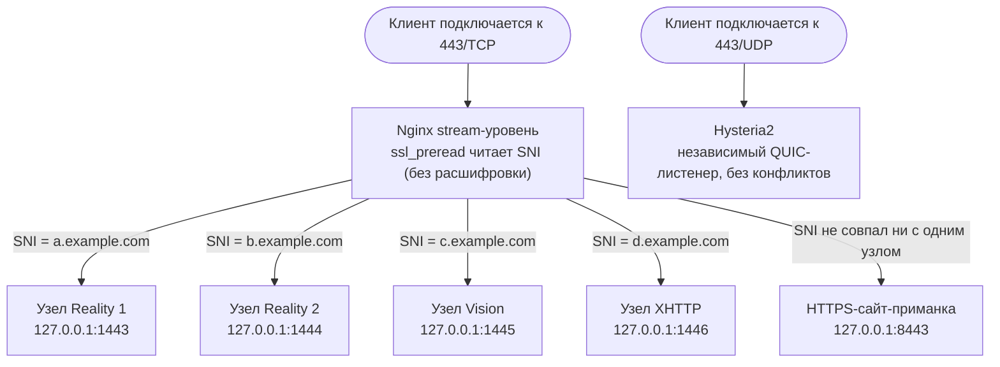

<div align="center">

# JQ's Proxy Stack Manager

**Универсальный менеджер прокси-сервера для Linux · три ядра: Xray / sing-box / mihomo**

<p>
  
  
  
  
  
</p>

<p>
  <a href="README.md">简体中文</a> ·
  <a href="README_EN.md">English</a> ·
  <a href="README_KO.md">한국어</a> ·
  <b>Русский</b>
</p>

</div>

```
       _    ___          ____    ____    __  __
      | |  / _ \        |  _ \  / ___| |  \/  |
   _  | | | | | |       | |_) | \___ \ | |\/| |
  | |_| | | |_| |       |  __/   ___) | | |  | |
   \___/   \__\_|       |_|     |____/ |_|  |_|

  Proxy Stack Manager  ·····  ◆ jinqians.com
  ──────────────────────────────────────────
  IP    ▶  x.x.x.x              Nginx     ▶  1.x.x
  Xray  ▶  x.x.x                Hysteria2 ▶  2.x.x
  Sing-box ▶  x.x.x             Mihomo    ▶  v1.x.x
  ──────────────────────────────────────────
```

---

## Введение

**Proxy Stack Manager (PSM)** — универсальный инструмент управления прокси-сервером Linux на чистом Bash. Одной командой `psm` устанавливаются VLESS Reality / Vision / XHTTP, Shadowsocks, Hysteria2, Snell, AnyTLS и другие протоколы; встроены **три ядра — Xray, sing-box и mihomo (Clash.Meta)**; централизованно управляются Nginx, SSL-сертификаты, ретрансляция realm, мониторинг трафика по узлам с уведомлениями Telegram-бота, защита VPS, приложения Docker и сервисы Cloudflare.

Каждый узел автоматически генерирует пару ключей и экспортирует ссылки с QR-кодами; поддерживается экспорт конфигураций Clash Meta / Shadowrocket / Surge. Сертификаты выпускаются и продлеваются автоматически через acme.sh — без ручных действий. Несколько протокольных узлов могут делить один публичный порт 443 (см. ниже).

Интерфейс доступен на **четырёх языках — 简体中文 / English / 한국어 / Русский**: язык выбирается при установке и переключается в главном меню в любой момент.

### Почему PSM

- **Одна команда — полное меню управления**: после установки достаточно запустить `psm`, все функции в одном CLI-меню
- **Три ядра на выбор**: Xray, sing-box и mihomo управляются параллельно; входящие протоколы, маршрутизация и исходящие настраиваются независимо для каждого ядра
- **Единое управление протоколами**: Reality / Vision / XHTTP / Hysteria2 / Snell / SS2022 / AnyTLS сосуществуют — не нужно держать отдельный скрипт под каждый протокол
- **Для долгоживущих VPS**: это не одноразовый установщик, а инструмент, объединяющий обновление, резервное копирование, восстановление, статус сервисов и усиление безопасности
- **Интерфейс на четырёх языках**: китайский / английский / корейский / русский переключаются в любой момент; `PSM_LANG=ru psm` — временное переопределение на сессию
- **Прозрачность и аудируемость**: проект написан на Bash, устанавливается строго в `/opt/psm`, все системные пути записи задокументированы

---

## Переиспользование порта 443

Несколько протокольных узлов могут делить один публичный порт 443 — не нужно открывать отдельный порт под каждый протокол или домен. Это работает через `ssl_preread` на уровне `stream` в Nginx: SNI (домен, к которому обращается клиент) читается прямо из TLS ClientHello без расшифровки трафика, после чего соединение направляется соответствующему бэкенду по домену.



Преимущества:

- **Наружу открыт только один порт**: файрволу достаточно разрешить 443 — уменьшается сканируемая поверхность атаки
- **Несколько «личностей» на одной машине**: разные протокольные узлы и сайт-приманка для зондирования GFW висят на 443 одновременно и различаются только доменом
- **Несколько арендаторов на узел**: не нужно открывать порт и ключи под каждого пользователя; несколько UUID под одним SNI делят общий вход, трафик учитывается раздельно
- **UDP 443 переиспользуется независимо**: Hysteria2 работает по UDP — это отдельный слушающий стек, не конфликтующий с TCP-маршрутизацией выше даже при одинаковом номере порта

---

## Как пользоваться

### Установка одной командой

Выполните от root на VPS — установка в `/opt/psm` и регистрация команды `psm` происходят автоматически:

```bash
# Через curl (рекомендуется)
bash <(curl -fsSL https://psm.jinqians.com)

# Через wget (если curl не установлен)
bash <(wget -qO- https://psm.jinqians.com)
```

> Повторный запуск той же команды на полностью установленной машине выполняет обновление `git pull`. Если обнаружено полуустановленное состояние после старой деинсталляции, установка автоматически перезапустится для восстановления.

После установки в любой момент введите:

```bash
psm
```

чтобы открыть интерактивное главное меню.

### Ручная установка

```bash
git clone https://github.com/jinqians/proxy-stack.git /opt/psm
bash /opt/psm/install.sh
```

### Системные требования

| Дистрибутив             | Минимальная версия     |
| ----------------------- | ---------------------- |
| Ubuntu                  | 20.04 LTS и новее      |
| Debian                  | 10 (Buster) и новее    |
| CentOS / RHEL           | 8 и новее              |
| Rocky Linux / AlmaLinux | 8 и новее              |
| Oracle Linux            | 8 и новее              |
| Amazon Linux            | 2 и новее              |
| Fedora                  | актуальные релизы      |

> Системы вне этого списка или более старые версии (CentOS 7, Debian 9, Ubuntu 18.04 и раньше) не адаптировались и не тестировались — работоспособность не гарантируется.

| Параметр            | Требование                                                       |
| ------------------- | ----------------------------------------------------------------- |
| Права               | root                                                               |
| Архитектура         | x86_64 · arm64                                                    |
| Базовые зависимости | `curl` или `wget` (достаточно одного) · `git` (ставится bootstrap-ом) |

Остальные зависимости (`jq`, `openssl`, `qrencode`, `unzip`, `iptables`, `fail2ban` и т. д.) устанавливаются по мере необходимости при первом использовании соответствующего модуля.

### Главное меню

```
══════════════════════════════════════════════════════════════
                  JQ's Proxy Stack Manager
══════════════════════════════════════════════════════════════
   1. Управление системой            12. Ретрансляция (realm)
   2. Управление sing-box            13. Cloudflare DDNS
   3. Ядро mihomo                    14. Управление Docker
   4. Управление Xray                15. Управление трафиком
   5. Управление Snell               16. Telegram-бот
   6. Управление ss-rust             17. Управление резервными копиями
   7. Управление Hysteria2           18. Восстановить резервную копию
   8. Управление Nginx               19. Обновить PSM
   9. Управление сайтами             20. Усиление безопасности
  10. Управление SSL-сертификатами   21. Язык / Language
  11. Показать все узлы
──────────────────────────────────────────────────────────────
   0. Выход
══════════════════════════════════════════════════════════════
```

### Неинтерактивный режим (для cron / systemd-таймеров)

```bash
manager.sh --ddns-update           # Однократное обновление Cloudflare DDNS
manager.sh --backup-full           # Однократное полное резервное копирование
manager.sh --backup-quick [метка]  # Однократное быстрое резервное копирование
manager.sh --update                # Обновление скриптов и компонентов PSM
manager.sh --traffic-check         # Однократная проверка учёта трафика
manager.sh --tgbot                 # Запуск демона Telegram-бота
manager.sh --reality-watchdog      # Однократная проверка живости целей Reality
manager.sh --honeypot-alert <ip> <port>  # Оповещение о срабатывании ханипота (вызывается fail2ban)
manager.sh --health-report         # Однократная отправка ежедневного отчёта
```

Это реальные точки входа, которые вызывают запланированные задачи модулей. Пункты меню «включить задание по расписанию» регистрируют их автоматически — настраивать cron вручную не нужно.

### Удаление

```bash
bash /opt/psm/uninstall.sh
```

Деинсталлятор удаляет созданные самим PSM команду-ярлык, записи cron, таймеры/сервисы systemd, правила файрвола/Fail2ban и по умолчанию спрашивает, удалять ли каталог `/opt/psm` вместе с конфигурацией. Такие компоненты, как Nginx, Xray, sing-box, mihomo, Hysteria2, Snell, ss-rust, acme.sh, сертификаты и приложения Docker Compose, подтверждаются по одному — сервисы, которые вы обслуживаете вручную, не будут удалены случайно.

---

## Возможности

### Ядро Xray

- **Xray** — Reality / Vision / XHTTP / SS2022, управление множеством узлов, автогенерация ключевых пар, экспорт VLESS URI (с QR-кодом) / Clash Meta / sing-box
- **Автопереключение целей Reality по живости** — для цели маскировки задаётся несколько кандидатов SNI; периодические реальные проверки рукопожатия TLS 1.3 автоматически переключают с «мёртвых» целей, старые клиентские ссылки продолжают работать
- **Умный поиск доменов-приманок Reality** — при настройке SNI маскировки Reality / XHTTP поисковые движки киберпространства (Netlas / Quake / ZoomEye / FOFA, ваш собственный API-ключ, хватает бесплатных лимитов) автоматически находят реальные сайты TLS 1.3 в **том же ASN / том же дата-центре**, что и ваш сервер: близкие, малоизвестные, без заезженных доменов крупных брендов. Кандидаты принимаются только после локальной проверки реальным рукопожатием (TLS 1.3 / X25519 / совпадение сертификата) и могут пакетно добавляться в пул живости выше. **Локальное сканирование портов не выполняется вовсе** (чтобы не провоцировать abuse-жалобы хостера) — поиск идёт по датасетам движков; без настроенного движка происходит возврат к ручному вводу
- **Разблокировка через исходящий Cloudflare WARP** — регистрация WARP-идентичности в один клик и подключение к исходящим Xray; в сочетании с правилами маршрутизации трафик Netflix / OpenAI и т. п. направляется через WARP
- **Маршрутизация исходящих** — пользовательские исходящие узлы (VLESS-Reality / TLS / XHTTP, Shadowsocks, Trojan, SOCKS5), пересылка по правилам домен / GeoIP / GeoSite на заданный исходящий

### Ядро sing-box (второе ядро)

- **Полный протокольный стек параллельно Xray** — входящие VLESS Reality, SS2022, Hysteria2, AnyTLS (нужен sing-box 1.12+), Snell (нужен sing-box 1.14+) делят одно ядро и один файл конфигурации
- **Управление маршрутизацией** — geosite / geoip / суффикс домена / IP CIDR / тег входящего → заданный исходящий или блокировка; встроенные пресеты «блокировка рекламы» и «запрет QUIC» в один клик
- **Менеджер исходящих** — 10 типов: ss / vless-reality / vless-tls / trojan / socks / anytls / snell / hysteria2 (обфускация Salamander) / tuic
- **Исходящий WARP** — переиспользует WARP-аккаунт, зарегистрированный на стороне Xray, как WireGuard-эндпоинт
- **Транзакционные изменения конфигурации** — перед каждым изменением создаётся автоматическая резервная копия; при неудаче `sing-box check` конфигурация и хранилище узлов откатываются, повреждённая конфигурация никогда не останется и не свалит сервис

### Ядро mihomo (третье ядро)

- **Поддержка экосистемы Clash.Meta** — входящие VLESS Reality, SS2022, Hysteria2, AnyTLS и Snell v4/v5 используют общий `/etc/mihomo/config.yaml`
- **Маршрутизация в стиле Clash** — напрямую управляет `proxies` / `proxy-groups` / `rules`, поддерживает DOMAIN-SUFFIX / DOMAIN-KEYWORD / GEOSITE / GEOIP / IP-CIDR / IN-NAME и фиксированный fallback `MATCH,DIRECT`
- **Менеджер исходящих** — типы исходящих ss / vless-reality / vless-tls / trojan / socks5 / anytls / snell / hysteria2 / tuic / wireguard
- **Переиспользование исходящего WARP** — использует WARP-аккаунт, зарегистрированный на стороне Xray, и генерирует mihomo wireguard proxy
- **Транзакционные изменения конфигурации** — каждое изменение пересобирает конфигурацию и запускает `mihomo -t -d /etc/mihomo -f /etc/mihomo/config.yaml`; при ошибке проверки выполняется автоматический откат без влияния на текущую рабочую конфигурацию

### Автономные протоколы и ретрансляция

- **Hysteria2** — UDP-прокси, парольная аутентификация, ограничение полосы, маскировка masquerade
- **Snell** — v4 / v5 / v6, аутентификация PSK, экспорт в формате Surge
- **SS 2022** — автономное развёртывание shadowsocks-rust, экспорт `ss://` URI (с QR-кодом)
- **Ретрансляция realm** — управление правилами проброса портов TCP / UDP (транзитная машина → конечная), отчёты о состоянии транзитного сервера через Telegram

### Базовые сервисы

- **Nginx** — мультипротокольная маршрутизация по SNI, управление сайтами, HTTPS-сайты-приманки
- **SSL-сертификаты** — автоматический выпуск через acme.sh (HTTP-01 / wildcard DNS-01), автопродление
- **Cloudflare** — динамическое обновление DDNS, управление DNS-записями, wildcard-сертификаты DNS-01
- **Cloudflare Tunnel** — публикация локальных сервисов (приложений Docker, панелей управления и т. д.) на заданном домене без открытия портов
- **Cloudflare Access** — шлюз с проверкой e-mail перед доменами, опубликованными через Tunnel/Nginx; создан для защиты административных приложений вроде Portainer и Nginx Proxy Manager
- **Docker** — установка и управление, магазин приложений в один клик (Portainer / Uptime Kuma / Netdata / AdGuard Home / Vaultwarden / Alist и др.), проверка конфликтов портов перед развёртыванием, выбор способа публикации (только локально / напрямую в интернет / реверс-прокси Nginx / Cloudflare Tunnel), тома данных включаются в резервные копии

### Усиление безопасности

- **Усиление SSH** — переход на вход по ключу, отключение парольной аутентификации, смена порта в один клик; все рискованные изменения применяются через `reload` (текущая сессия не обрывается) с 5-минутной автоотменой: без подтверждения изменение откатывается, и вы не запрёте себя снаружи
- **Fail2ban против перебора** — автоматическая блокировка неудачных входов SSH, встроенное правило «рецидивистов» с более длительными банами для повторно заблокированных IP, поддержка белого списка
- **Ханипот-ловушки** — ловушки на портах, где на этой машине не должно быть сервисов (RDP / MSSQL / Telnet и т. д.); любое подключение считается разведкой — постоянный бан и оповещение в Telegram. Проверка занятости портов автоматически исключает SSH, настроенные прокси-протоколы, сервисы Docker и т. д. — легитимные сервисы не пострадают

### Эксплуатация и мониторинг

- **Управление трафиком** — месячная квота на узел, автоматическая приостановка при достижении порога, поминутный учёт, автосброс в конце месяца
- **Управление сроками** — дата истечения на узел, автоматические напоминания и приостановка сервиса, продление в один клик
- **Ежедневный отчёт о состоянии** — сводка в Telegram по расписанию: предупреждения по трафику, напоминания об истечении, переключения живости Reality, статус SSH/BBR/Fail2ban/ханипота/WARP — вся картина одним сообщением
- **Telegram-бот** — запрос трафика узлов, управление привязками пользователей, продление сроков, отчёты — всё внутри Telegram, без входа на сервер
- **Резервное копирование и восстановление** — полные / выборочные копии (включая тома Docker), по расписанию, восстановление в один клик
- **Управление системой** — управление перегрузкой BBR, тюнинг сети sysctl, файрвол, DNS, часовой пояс и распространенные тесты VPS (локальная проверка, задержка/маршрут, NodeQuality, YABS, IP.Check.Place, RegionRestrictionCheck, bench.sh, LemonBench)
- **Многоязычный интерфейс** — 简体中文 / English / 한국어 / Русский; выбор при установке, переключение из меню, полностью переведены более 2000 строк интерфейса

---

## Структура каталогов

```
/opt/psm/
├── bootstrap.sh          # Точка входа установки одной командой
├── manager.sh            # Главная точка входа (интерактивное меню + неинтерактивные вызовы)
├── install.sh            # Мастер первичной установки
├── update.sh             # Самообновление и апгрейд компонентов
├── uninstall.sh          # Пошаговый деинсталлятор
├── config/               # Состояние и конфигурация времени выполнения (в gitignore)
├── lang/                 # Языковые таблицы (zh / en / ko / ru)
├── lib/
│   ├── common.sh         # Общие утилиты
│   ├── i18n.sh           # Многоязычный фреймворк
│   ├── xray/             # Reality / Vision / XHTTP / SS2022 / WARP / маршрутизация исходящих / живость / поиск доменов-приманок
│   ├── singbox/          # Второе ядро sing-box (Reality / SS2022 / Hysteria2 / AnyTLS / Snell / маршрутизация)
│   ├── mihomo/           # Третье ядро mihomo (Reality / SS2022 / Hysteria2 / AnyTLS / Snell / маршрутизация)
│   ├── security/         # Усиление SSH / Fail2ban / ханипот
│   ├── cloudflare/       # Tunnel / Access
│   ├── docker/           # Расширения Docker (резервные копии томов и др.)
│   ├── tgbot/            # Шаблоны уведомлений Telegram / ежедневный отчёт / статус ретрансляции
│   ├── expiry/           # Управление сроками
│   ├── hysteria2.sh / snell.sh / ssrust.sh / realm.sh
│   ├── nginx.sh / cert.sh / cloudflare.sh
│   ├── docker.sh / system.sh / vps_test.sh / backup.sh / traffic.sh
│   └── tg_bot.sh
├── scripts/              # Вспомогательные скрипты разработки (проверка i18n и др.)
├── templates/            # Шаблоны конфигураций (включая шаблоны магазина приложений Docker)
└── backup/               # Архивы резервных копий
```

---

## Пути записи

PSM по возможности держит собственное состояние в `/opt/psm`, но некоторым функциям необходимо писать в системные сервисы, сертификаты, файрвол или конфигурации приложений. Основные пути:

| Путь                                                                        | Назначение                                           |
| --------------------------------------------------------------------------- | ---------------------------------------------------- |
| `/opt/psm`                                                                | Программа PSM, состояние, конфигурация, резервные копии, проекты Docker Compose |
| `/usr/local/bin/psm`                                                      | Глобальная команда-ярлык                             |
| `/etc/systemd/system/psm-*.service` / `/etc/systemd/system/psm-*.timer` | Задачи по расписанию и демоны PSM                    |
| `/usr/local/etc/xray` / `/usr/local/bin/xray`                           | Конфигурация и бинарник Xray                         |
| `/etc/sing-box` / `/usr/local/bin/sing-box`                             | Конфигурация и бинарник sing-box                     |
| `/etc/hysteria` / `/usr/local/bin/hysteria`                             | Конфигурация и бинарник Hysteria2                    |
| `/etc/realm` / `/usr/local/bin/realm`                                   | Конфигурация и бинарник ретрансляции realm           |
| `/etc/nginx`                                                              | Сайты Nginx, stream-маршрутизация и SSL-файлы        |
| `/root/.acme.sh`                                                          | Аккаунт acme.sh и кэш выпуска сертификатов           |
| `/etc/fail2ban` / `iptables`                                            | Правила Fail2ban, ханипот и цепочки учёта трафика    |
| `/etc/cron.d/psm-*`                                                       | Записи cron для резервного копирования, DDNS и т. д. |

Если вы собираетесь использовать PSM на боевом VPS, сначала изучите вывод установки и подсказки деинсталлятора; если на машине уже есть важные конфигурации Nginx, Docker или Cloudflare Tunnel, предварительно сделайте снапшот или ручную резервную копию.

---

## Часто задаваемые вопросы

### Как переключить язык интерфейса?

Выберите «21. Язык / Language» в главном меню — переключение между 简体中文 / English / 한국어 / Русский сохраняется. Команда `PSM_LANG=ru psm` временно переопределяет язык только для текущей сессии.

### Что будет при повторном запуске установочной команды?

Если `/opt/psm` — полная установка, скрипт выполнит обновление `git pull`. Если обнаружено полуустановленное состояние после старой деинсталляции (например, `.git` на месте, но команды `psm` или каталога конфигурации нет), установка автоматически перезапустится для восстановления.

### Xray, sing-box или mihomo — что выбрать?

Это независимые параллельные ядра. Сторона Xray богаче инструментами (watchdog живости, поиск доменов-приманок, учёт трафика); sing-box покрывает больше протоколов (AnyTLS, нативный входящий Snell) и имеет более современную конфигурацию маршрутизации; mihomo лучше подходит для экосистемы Clash.Meta, маршрутизации правилами (`proxies` / `proxy-groups` / `rules`) и сценариев, где нужна готовая Clash-конфигурация. Используйте одно ядро или несколько сразу — каждое управляет своими портами и узлами.

### Почему деинсталлятор позволяет сохранить некоторые компоненты?

Nginx, Docker, сертификаты, Cloudflare Tunnel и т. д. могут использоваться другими сайтами или сервисами. Деинсталлятор PSM по умолчанию удаляет только следы самого PSM, а общие компоненты подтверждает по одному.

### Перезапишет ли он существующую конфигурацию Nginx?

PSM управляет только собственными сайтами и stream-маршрутизацией. Если есть боевые сайты — сначала сделайте резервную копию `/etc/nginx` и перед операциями в меню проверьте домены, порты и пути сертификатов.

### Можно ли установить без root?

Нет. PSM устанавливает системные пакеты, пишет в systemd, управляет Nginx, сертификатами, файрволом и прокси-сервисами — root обязателен.

### Подходит ли для централизованного управления многими серверами?

Сейчас PSM ориентирован на локальное управление одним VPS — центральной панели, синхронизации состояния и удалённой оркестрации нет. Ретрансляция realm может пересылать трафик между машинами, но каждая машина управляется независимо.

---

## Материалы проекта

- [简体中文 README](README.md) · [English README](README_EN.md) · [한국어 README](README_KO.md)
- [Журнал изменений](CHANGELOG.md)

---

## Поддержать

Если проект вам помог, угостите автора кофе ☕️ — принимается USDT.

| Сеть              | QR       | Адрес                                          |
| ----------------- | -------- | ---------------------------------------------- |
| **TRC20**   |          | `TUe1x22n9FPAgLt6YFcQyxWgvTZFNgKBgM`         |
| **Polygon** |          | `0x5632f6d76a03543c53d750918c9c6a4c372f1597` |

Спасибо каждому, кто поддерживает проект!

---

## Лицензия

Проект распространяется под открытой лицензией [GNU Affero General Public License v3.0 (AGPL-3.0)](LICENSE).
